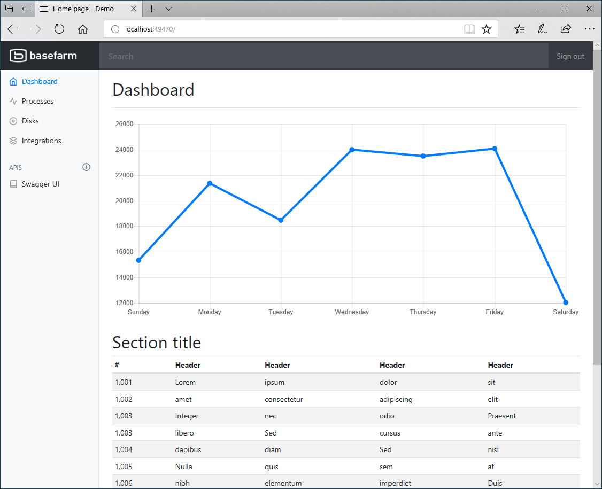
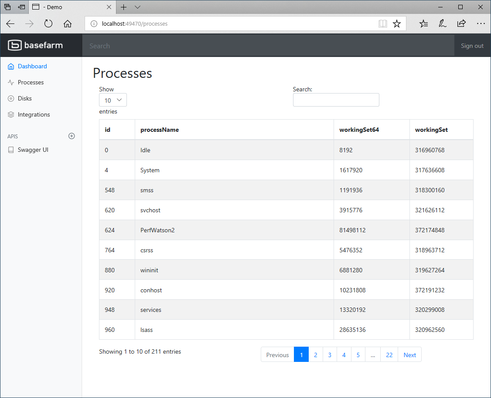
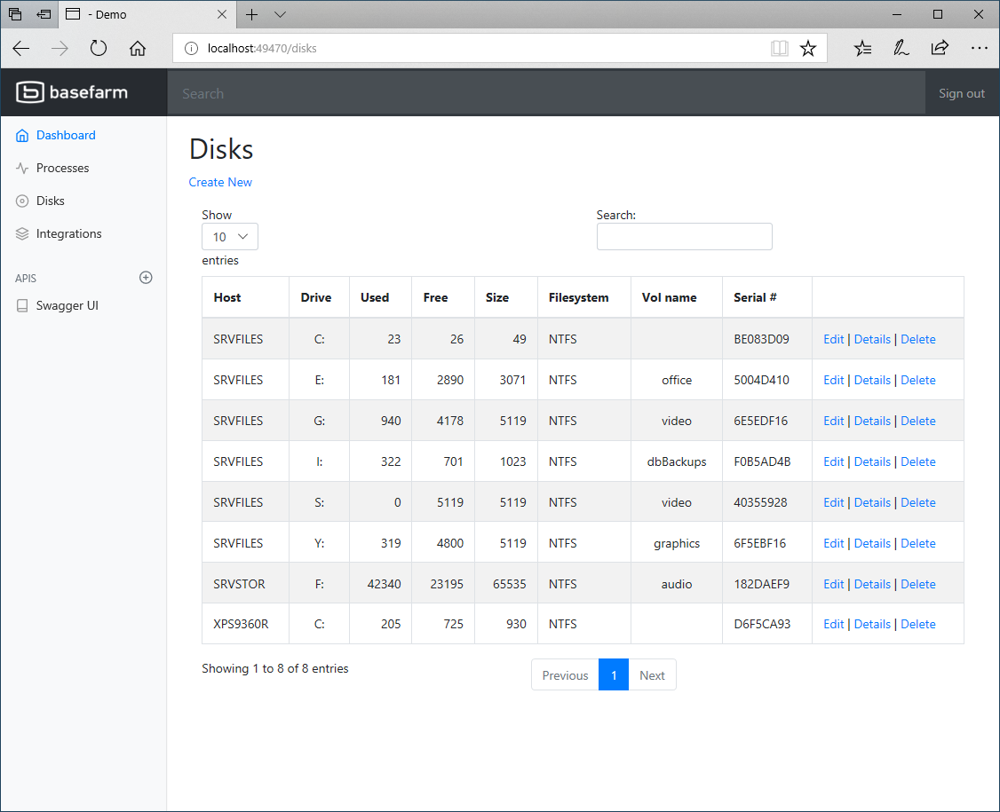
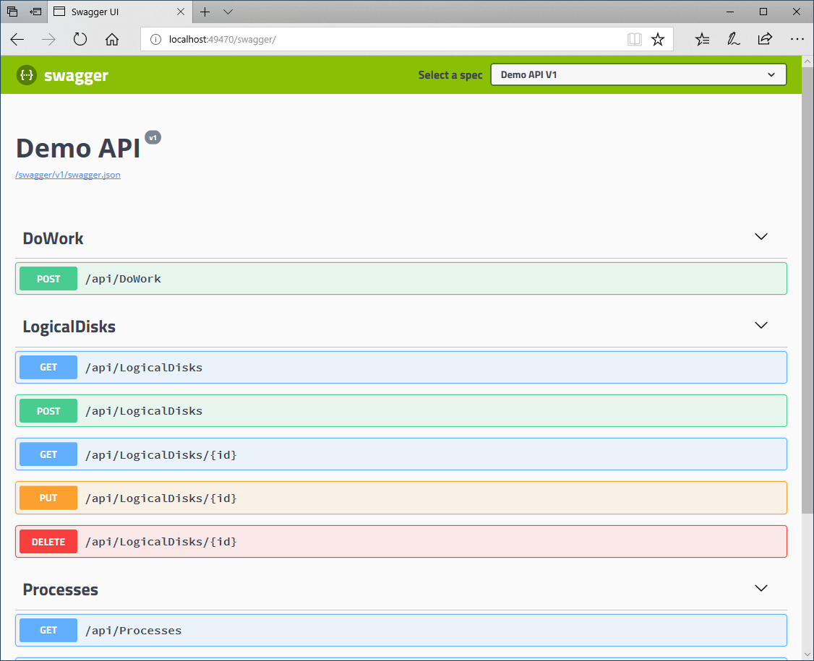

# Demo Web 

This is our _go-to_ demo Web App app built on the recent Microsoft technologoy stack. This demo project uses:

* [ASP.NET Core](https://docs.microsoft.com/en-us/aspnet/core/) - a cross-platform, high-performance, open-source framework for building modern, cloud-based, Internet-connected applications
* .NET Framework Core
* [Razor Pages](https://docs.microsoft.com/en-us/aspnet/core/mvc/razor-pages/index?tabs=visual-studio) - is a new feature of ASP.NET Core MVC that makes coding page-focused scenarios easier and more productive.
 
## Deploying the app

As this app is built using [.NET Core](https://www.microsoft.com/net/) it can run on all plattforms the [.NET Core runtime supports](https://www.microsoft.com/net/download/all).

More information about how to deploy can be found [here](./docs/HOWTO-Deploy.md)

## Content

* [PowerShell REST API demo](./docs/PS-API-DEMO.md)

## Screen shots

#### Dashboard
Shows some sample _dashboard_ type of views. Let me know what we should put in there? 

#### Processes
Shows the processes in the current app 

#### Disks
Show the disks in the SQLite database, disks can be added, updated and removed using the REST API

#### REST API
The Swagger UI documentation for the REST API

### Issues

Report any issues [here](https://github.com/yooakim/demo/issues/new) right in this repository

